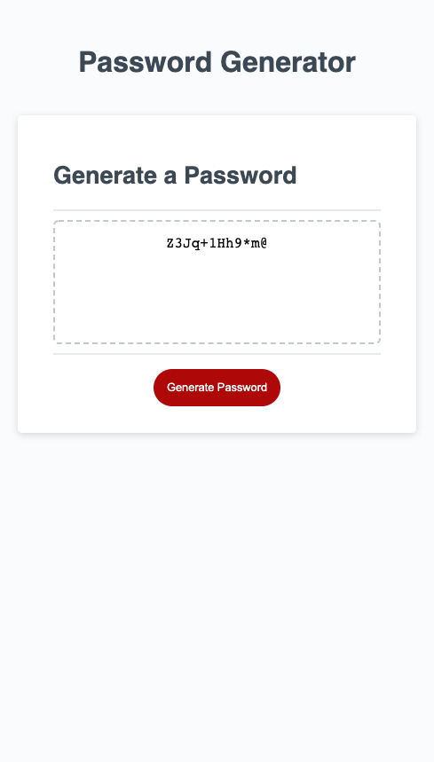

# RYK-Module-03-07-12-22

## User Story

AS A private person who cannot easily think of a strong password and does not want others to guess it easily
I WANT to quickly generate random and complex alphanumerical password including symbols and switch from existing password whenever I sense any breach
SO THAT I feel safe that my personal data has not been compromised

## Acceptance Criteria

GIVEN I need a complex password with a length of at least 8 characters and no more than 128 characters
THEN I am presented with an option to input the number of characters I want in my password
WHEN I put in 0-7 or any number greater than 128 or non-numerical values
THEN the message alerts I must choose a different value between 8 and 128
WHEN I am prompted what to include in the password
THEN I am able to choose whether I want any lowercase letters, uppercase letters, numbers or symbols inside my password with simple Yes/No options
WHEN the password is generated
THEN the password properly shows up inside the box instead of "Your Secure Password"

## Link
<a href = https://leanonruthie.github.io/Random-Password-Generator>https://leanonruthie.github.io/Random-Password-Generator/</a>

## Screenshot

